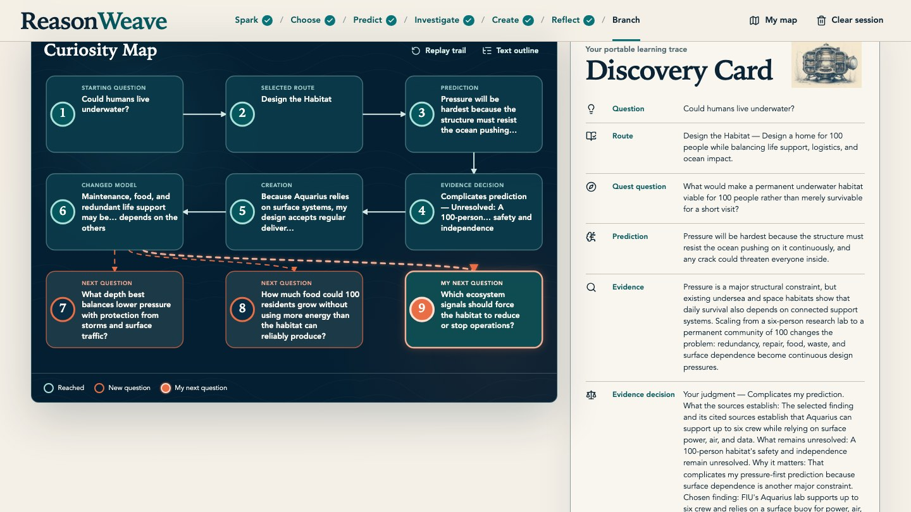

# ReasonWeave

> Make reasoning visible.

ReasonWeave is a curiosity studio for learners ages 13+. It turns a learner's question into a short, source-backed investigation where they make a prediction, examine evidence, create under constraints, reflect on what changed, and leave with a visual Learning Trace.

Built for the OpenAI Build Week Education track.



## Why it exists

Generative AI can provide a polished answer before a learner has done the valuable intellectual work. ReasonWeave is designed to preserve that work. It is not a homework-answer generator, chatbot, grading system, or endless tutor. Instead, it creates a finite learning experience that asks the learner to form and revise their own view.

```text
SPARK → CHOOSE → PREDICT → INVESTIGATE → CREATE → REFLECT → BRANCH
```

- **Spark:** start with a question worth exploring.
- **Choose:** select one of three routes through the topic.
- **Predict:** commit to an initial model before seeing the evidence.
- **Investigate:** assess sourced findings and their limits.
- **Create:** make a comparison, design, causal model, proposal, or argument.
- **Reflect:** describe what changed and what remains uncertain.
- **Branch:** choose a next question, then export the finished Learning Trace.

The included underwater-habitat demo exercises the complete flow without an account or API key.

## Try it locally

Requirements: Node.js 20.9+ and npm.

```bash
npm ci
npm run dev
```

Then open [http://localhost:3000](http://localhost:3000) and select **Try complete demo**.

The default experience is seeded and does not contact an AI provider. Live generation is intentionally disabled by default. If you enable it for local development, place a server-side OpenAI key only in the ignored `.env.local` file; never commit or expose it to the browser. A public deployment should keep live generation disabled until server-side credentials, distributed abuse protection, and spend controls are in place.

```bash
cp .env.example .env.local
```

## Privacy and safety

- No accounts or database: quest state is stored in the browser for up to 24 hours.
- The included demo is deterministic and clearly labeled as pre-generated.
- API routes validate input, enforce a request-size limit, moderate live requests, and return safe error messages.
- Live generation is a separate, opt-in deployment mode and should remain disabled unless server-side credentials and production abuse/spend controls are in place.

## Built with

Next.js, React, TypeScript, Zod, the OpenAI Responses API, OpenAI web search, Vitest, Playwright, and axe-core.

## Verify

```bash
npm run format:check
npm run lint
npm run typecheck
npm test
npm run evals:fixtures
npm run build
```

For the no-key judge path:

```bash
npm run test:e2e:no-key
```

## Project links

- [OpenAI Build Week submission](https://devpost.com/software/reasonweave-wynpvd)
- [Demo video](https://youtu.be/3SD1fCIjkBI)

## License

See [LICENSE](LICENSE). Third-party notices are in [THIRD_PARTY_NOTICES.md](THIRD_PARTY_NOTICES.md).
