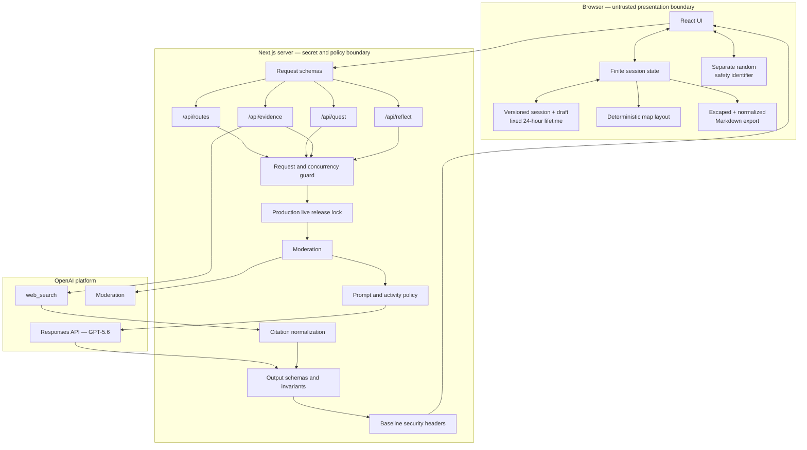

# Architecture

ReasonWeave is a small, server-mediated Next.js application with a deliberately finite state machine. The architecture protects four product invariants that make reasoning visible:

## Validation ledger

The checkpoint records in this section are historical, exact-source evidence. They do not attest later refactor commits or the repository's current `HEAD`. The current source layout is documented separately below so architectural guidance can evolve without relabeling historical release proof.

Exact `0bd5aef89ab4715477491b462c13be0c5978ac6b`, tree `4d6162e7a7632bba96f582818f44d98bbff956a0`, also has fresh no-hardlink/no-alternates clone proof (exact HEAD/tree, unique pack inode/link count 1, and `npm ci` adding 464 packages); keyboard stress 5/5 remains direct-worktree proof.

> **Validated application checkpoint — July 19, 2026:** exact `0bd5aef89ab4715477491b462c13be0c5978ac6b`, tree `4d6162e7a7632bba96f582818f44d98bbff956a0`, has direct clean committed-worktree proof: format/lint/typecheck; 46/596 Vitest; 145/145 fixtures; production build (`/` and four APIs); bundle 464,236/113,930 initial, map 16,356/5,592, card 15,598/5,051, UI 31,954/10,643, seeded 21,224/6,904; Playwright 28 pass/68 deliberate skip; no-key 1/1 zero API; keyboard stress 5/5; online/offline audit 0; expected-only reviewer/test/dev email and loopback scan matches; diff and clean status. It also adds a versioned session migration and an evidence-to-creation anchor: 2–8 normalized words with at least two specific words, appearing exactly in the learner's design move and creation artifact. This checks continuity, not semantic quality or grading. The visual Curiosity Map is hidden from assistive technology in favor of an ordered screen-reader trace. Earlier `acfdc37` assertions are historical predecessor evidence.

**Historical predecessor checkpoint:** exact source `acfdc37c3bc3e13fefc24d8fdb2c82b214b38f5a` (tree `9b8ca0ebc03cc3b00f8f553d18b06297d253f274`) passed a fresh no-hardlink/no-alternates clone: npm ci 464 packages/audited 465 with 0 vulnerabilities; format, lint, typecheck; 44 files / 509 Vitest tests; 145/145 deterministic fixture evaluations; production build; bundle budgets; serial Playwright 28/68 (96 total); no-key Chromium 1/1 with zero API requests; online and offline audit 0; tracked/client scans, diff check, and final clean status. Initial `/page` JavaScript was 458,996 raw / 112,371 gzip across six chunks; Curiosity Map was 16,372 / 5,682, Discovery Card 15,163 / 4,918, two UI chunks 31,535 / 10,600, and the seeded-demo chunk 21,186 / 6,890. Rendered desktop 1280 and mobile 390 checks plus adversarial 1280/375/320 E2E passed with no horizontal overflow; the compact card row was bounded while full text remained in disclosure/export. Independent final education and release reviews found no P0–P3. No provider/Keychain secret read, OpenAI, media, deployment, publication, or submission action occurred.

Historical predecessor `5ddbac355e1ab90fa7e3a8533ca2cbf995c5ab57` (tree `b9632e2924dccfd13d26accb9aa029c2bfd86d3e`) retains its exact 464-package clean-install proof: format/lint/typecheck, 40 files / 467 tests, 142/142 fixtures, production build, authoritative serial Playwright 28/68 (96 total), no-key Chromium 1/1 with zero API requests, offline low-threshold audit with 0 vulnerabilities, zero-finding scans after fixture classification, diff check, clean final status, the same six-chunk bundle measurements, and independent review with no P0/P1/P2. Earlier predecessor `9d56d2447aa2ed4aad22534ad1861afde1bfc900` retains its exact 474,843 / 118,164 initial and 26/62 serial-browser metrics; predecessor `9f7e53f` supplied the immediately prior current-checkpoint proof. On July 19, metadata-only elevated checks confirmed the exact Keychain service/account `com.chadb.agent-keys` / `ELEVENLABS_API_KEY` is configured; the earlier sandboxed exit-1 result was a false negative, and no secret was read.

Historical release-tooling checkpoint `4211bbff771597e97ecacd4eb3dbbe33c6472735` (tree `02558c6631be4ffd08ed6a158a3abffef6542c3a`) retains its exact clean no-hardlink/no-alternates proof: format/lint/typecheck, 40/463, 142 fixtures, build/bundles, Playwright 24/56, no-key 1/1 with zero requests, focused 7/93, preservation 23, audit/scans 0, and clean status. Its 11,139-byte receipt `current-repo-4211bbf-clean-checkout-attestation.json` has SHA-256 `a79528b4032dc79a3b32c88cb664009681914de98dcc4e9c6f52276e3593e078`. It canonicalized ReasonWeave/reasonweave and bound versioned receipts to inode-anchored opened media buffers; `ee5b479` and `15d3d57` are also historical application/source predecessors rather than the current app identity.

1. the learner predicts before evidence is revealed;
2. citations come only from actual web-search output;
3. the learner judges one current, source-backed finding and applies that same finding to a concrete design choice before reflection;
4. the OpenAI API key never reaches the browser.

## Source layout

This section describes the repository's current `HEAD`; unlike the ledger above, it is not an exact-checkpoint proof claim.

The public learner-app import remains `components/wonderlab-app.tsx`. It is a compatibility façade over `components/quest/quest-app.tsx`, which owns learner state, persistence, transitions, and request orchestration. Each stage renders through a dedicated module under `components/quest/screens/`; focused API-error, evidence-note, learner-work, option, and presentation modules replace a generic helper layer. Application callers and focused UI tests therefore retain the same import/API while stage presentation can evolve independently. `components/curiosity-map.tsx` and `components/discovery-card.tsx` stay separate deferred feature chunks.

Use [the developer workflows](developer-workflows.md) for the provider-free local gate. Release media, screenshot, narration, and submission procedures deliberately retain their existing paths and are documented separately because they are receipt-bound artifacts, not ordinary application modules.

## System view



## Responsibility boundaries

### Browser

- Renders Spark, Choose, Predict, Investigate, Create, Reflect, and Branch.
- Enforces the user-visible prediction gate and disables invalid transitions.
- Requires an explicit learner chain before reflection: a current sourced Evidence Decision (what the selected sources establish, where their exact source scope stops, impact, and a `supports`/`challenges`/`complicates` relationship to the prediction), then an `EvidenceApplication` tied to that same finding with a 20–400-character concrete design choice. The complete ordered linked source list appears beside the decision fields. Changing the selected finding clears that link and the creation self-check.
- Stores one anonymous session and one draft in separate v4 envelopes with a fixed 24-hour lifetime; expired work is removed while the page stays open or on the next load.
- Stores a random `safety_identifier` separately from learner work so Clear and the 24-hour expiry do not reset abuse-safety continuity.
- Computes map coordinates from semantic nodes and edges.
- Creates the map, Discovery Card, and Markdown export with the learner's Evidence Decision, selected finding, exact linked sources, source-scope boundary, and evidence-to-design link, without hidden prompts or private identifiers; authored HTML/active Markdown is escaped and HTTP(S) source destinations are normalized. The final card presents a compact at-a-glance learning payoff while retaining the complete journey, learner reflection, and AI response inside a native disclosure. On the first Branch selection at widths of 930 CSS pixels or less, focus moves to the named Discovery Card region and keeps that payoff visible while its deferred chunk loads; desktop and subsequent user selections retain focus on the selected radio, while restored/already-selected paths do not auto-focus the card. The live status becomes **Card unlocked. Map updated.**
- Presents loading, timeout, retry, and explicit demo-mode states.

The browser is not trusted to protect a secret or validate model output. Server boundaries must repeat validation and policy checks.

### Server

- Reads `OPENAI_API_KEY`, `OPENAI_MODEL`, and production live-release controls from server environment state.
- Defaults production to seeded-only. Before constructing or returning an OpenAI client, it requires exact live enablement, a future UTC expiry no more than 30 days away, exact GPT-5.6 model selection, and—on Vercel—a full approved Git SHA matching the deployed source SHA. Every check returns the same sanitized `LIVE_GENERATION_DISABLED` response when closed.
- Pins the OpenAI SDK to the official API origin and default service tier; SDK logging and transport retries remain disabled.
- Streams each request body under the route-scoped deadline, cancels and returns `413` above 64 KiB, then parses and length-limits fields.
- Moderates the starting question and relevant learner free text.
- Applies best-effort per-instance request and concurrency limits before paid provider work. Rejected unseen identifiers are not retained after global/concurrency rejection, and the instance tracks at most 512 session buckets.
- Applies safe-activity rules and a deterministic learner-agency classifier. Submit-ready completion requests receive fixed redirect instructions in every generation stage, while inquiry and scaffolding remain allowed.
- Propagates one request-scoped abort signal through moderation and Responses calls, with controlled, budget-aware retry behavior.
- Sets `text.verbosity` to `low` on all four structured GPT-5.6 Responses calls while retaining their strict schemas, stage-specific output-token ceilings, and application validators.
- Parses structured output and checks cross-field invariants before returning it.
- Admits evidence citations only when Responses output contains a `web_search_call` with `status: completed`; `failed`, `in_progress`, and `searching` fail closed.
- Extracts citations only from actual completed web-search results/annotations.
- Maps internal failures to stable, learner-readable error codes without leaking prompt, key, raw provider error, or full learner content.
- Adds `Content-Security-Policy`, `Permissions-Policy`, `Referrer-Policy`, `X-Content-Type-Options: nosniff`, and `X-Frame-Options: DENY` to application responses; production CSP excludes `unsafe-eval`.

### OpenAI

- In live mode, GPT-5.6 receives the relevant learner/session entries through the server and generates semantic route, quest, evidence-synthesis, and reflection content.
- Web search supplies source material and returned citation metadata.
- Moderation supports the server's input safety boundary.
- The separately browser-stored random identifier is forwarded with live requests as OpenAI's `safety_identifier`; it contains no identity-derived value.

The platform does not own application state, map layout, user identity, or browser persistence. Provider handling of live inputs remains governed by the configured OpenAI project/account terms; the seeded path does not send its quest through these generation calls.

## Finite state model

```mermaid
stateDiagram-v2
    [*] --> spark
    spark --> choose: three routes accepted
    choose --> predict: one route selected and quest accepted
    predict --> investigate: meaningful prediction stored
    investigate --> create: evidence accepted or verified demo evidence loaded
    create --> reflect: artifact + sourced decision + same-finding evidence-to-design link stored; learner review confirmed
    reflect --> branch: reflection accepted and exactly one next question selected
    branch --> spark: explicit start-new-quest action only
    spark --> seeded: explicit demo action
    choose --> seeded: recoverable live failure
    predict --> seeded: recoverable live failure
    investigate --> seeded: recoverable live failure
    seeded --> choose: seeded session initialized
```



State transitions are application rules, not model suggestions. Evidence data may be prefetched only if it cannot become visible or enter the export before a prediction is recorded. Reflection produces exactly three candidate next questions, but the learner must select exactly one before the Discovery Card and Markdown export unlock. The selected text is labeled `My next question` in the map, card, and export. On a narrow first selection, the already-mounted card region receives focus before the deferred card finishes loading; that presentation behavior does not alter session state. Selecting a question does not automatically start another quest; the journey remains finite until the learner explicitly starts one.

## API contracts

All endpoints return a typed success payload or a safe error envelope. Exact schemas live in production code; these are the stable semantic boundaries.

The same cross-cutting boundary applies before every endpoint reaches OpenAI: the request stream must remain within 64 KiB and the route deadline, validation and moderation must pass, and submit-ready assignment outsourcing receives learner-owned redirect guidance rather than finished work.

### `POST /api/routes`

Input: question, level, duration, anonymous safety identifier.  
Server work: validate → moderate → generate → schema-parse → diversity check.  
Output: exactly three routes with ID, title, hook, lens, activity type, estimated minutes, and icon key.

### `POST /api/quest`

Input: validated session context and selected route.  
Server work: generate a finite, safe plan; validate time and constraint bounds.  
Output: driving question, prediction prompt, investigation framing, creation challenge, a canonical step-by-step time budget, safety note, and hint. Every mandatory five-minute step has positive time: choose 30s, predict 30s, investigate 1m, create 1m 30s, reflect 1m, and branch 30s. Workload is duration-bound: 5 minutes returns exactly 2 constraints / 1 completion criterion, 10 minutes returns 2–3 / 1–2, and 15 minutes returns 2–4 / 1–4.

### `POST /api/evidence`

Input: question, route, learner prediction, level, and duration.  
Server work: require prediction → web search → concise synthesis → annotation extraction → source association validation.  
Output: two to four `evidence`, `inference`, or `open_question` items; normalized sources; concise explanation; optional uncertainty note.

An `evidence` item without a matching returned source is invalid. An inference or open question may be unsourced only when its label remains explicit.

### `POST /api/reflect`

Input: the bounded submitted Evidence Lens, the learner's source-backed Evidence Decision, same-finding `EvidenceApplication`, learner artifact, and all three reflection fields.  
Server work: validate the Evidence Lens, decision, and application shapes → cross-check both references name the same sourced `evidence` finding within that submitted bundle → moderate the evidence/source context, decision text, application, and other relevant free text → generate → parse → specificity/prohibited-claim checks.  
Output: concise feedback, discovery summary, changed-thinking summary, optional tradeoff, exactly three next questions, and semantic map content/deltas.

Both the client state transition and `POST /api/reflect` verify that the decision references an item in the submitted Evidence Lens whose kind is `evidence` and whose source list is non-empty. The relationship is one of `supports`, `challenges`, or `complicates`; establishes, source-scope boundary, and impact are separately learner-authored fields trimmed to 15–300 characters; and `EvidenceApplication` must reuse the decision's `evidenceItemId` with a trimmed 20–400-character `designChoice`. The existing persisted property remains named `unresolved`, so this teaching upgrade adds no schema/provider change. Reflection generation receives the actual selected finding and complete ordered source title/domain context, the learner's judgment, and their evidence-to-design link rather than trusting opaque IDs as evidence; exact source URLs remain in the learner-facing Evidence Lens, Discovery Card, and export rather than entering the reflection prompt. Feedback validators require meaningful concepts from the learner's design link as well as other learner-authored inputs. The model must attribute the recorded relationship to the learner instead of silently replacing it or treating it as unquestionable fact.

Prototype trust boundary: `/api/reflect` validates consistency inside the client-supplied Evidence Lens bundle, but it does not server-attest that `/api/evidence` previously issued that bundle. This is acceptable for the account-free, same-user prototype because the decision is neither a grade nor a shared record. Signed or server-retained evidence provenance is deferred until shared, graded, or cross-user trust exists.

## Citation integrity

Citation admission fails closed. At least one Responses `web_search_call` with `status: completed` is required before any evidence citation can be admitted. `failed`, `in_progress`, and `searching` states are not partial success: the route uses its one bounded retry and then returns the typed citation-verification error. A URL annotation is accepted only when it belongs to exactly one matching Responses `output_text` message and its full inclusive range lies inside that exact serialized statement. Cross-message ranges, swapped or duplicate keys, extra keys, malformed values, reversed ranges, and out-of-range spans are rejected. Model-provided URLs can narrow returned citations but can never create a source.

```mermaid
sequenceDiagram
    participant B as Browser
    participant S as Evidence route
    participant O as Responses API + web_search
    B->>S: question + route + prediction
    S->>S: validate prediction and moderate
    S->>O: grounded evidence request
    O-->>S: response + completed search + source annotations
    S->>S: normalize returned URLs only
    S->>S: ensure each Evidence item resolves to source IDs
    alt valid
      S-->>B: evidence bundle
    else missing or invalid association
      S-->>B: typed verification error; no invented URL
    end
```

The application must not manufacture a URL from model prose, a remembered domain, or a seeded fixture while labeling the result live. The seeded fixture carries its own pre-generated label.

## Session and privacy model

The session contains a random ID, timestamps, learner-selected settings, generated content, learner-authored text, the selected source-backed Evidence Decision, its same-finding `EvidenceApplication`, mode (`live` or `seeded_fallback`), and semantic map. The session and draft are stored only in the learner's browser as v4 envelopes with a fixed lifetime of 24 hours from their first save; editing does not slide that deadline forward. The open application schedules their removal at expiry, and the next load rejects and removes expired, invalid, future-dated, or unsupported envelope versions. Compatible v4 quest records saved before canonical time budgets existed are migrated in place; over-limit historical constraints and criteria receive a storage-only compatibility marker and remain visible in the resumed trace and Markdown export. There is no account, database, cross-device sync, or long-term profile.

The random safety identifier is a separate browser-local record that survives Clear and learner-work expiry until the user clears site data. It must not contain or be derived from a name, email, school ID, or IP address. The browser forwards it to the server and OpenAI only with live requests for abuse-safety continuity. Relevant question, route, prediction, Evidence Lens, Evidence Decision, artifact, reflection, and generated context also cross the server/OpenAI boundary when required by a live stage. The server should avoid logging full request bodies in production.

Discovery Card and Markdown export are one-way presentation boundaries: they include only learner-visible quest content, including the selected finding, citations, relationship, learner decision, and evidence-to-design choice; escapes authored raw HTML and active Markdown constructs; normalizes source link destinations; and excludes session/safety identifiers, timestamps, hidden prompts, and provider metadata.

## Reliability strategy

- Validate at input, provider-output, and cross-field invariant boundaries.
- Keep all four structured Responses calls at intentionally low text verbosity without loosening schemas, output-token ceilings, or validators.
- Read request streams under the same route-scoped deadline used by provider work; cancel and reject above 64 KiB without waiting for the remaining body.
- Abort provider requests after a documented timeout.
- Keep SDK transport retries disabled; retry only invalid output shape, unsafe generated activity, or missing citation validation, and at most once within the request budget.
- Reject excess anonymous requests with `429` and `Retry-After` before moderation or generation begins.
- Bound the per-instance session map and avoid inserting identifiers whose requests are rejected before provider work.
- Preserve prior browser state during an error.
- Return an actionable `Try again` path.
- Offer `Open complete demo` after a live failure and `Try complete demo` as an explicit Spark action.
- Label seeded mode on every view where provenance could be misunderstood.
- Render a semantic text outline if the visual map fails.
- Apply and verify baseline response headers without describing local header proof as deployment proof.
- Admit citations only from completed search calls; failed or unfinished search states consume the bounded retry and then return the typed verification error.
- Write an allowlisted, ignored JSON evidence report for every completed live-evaluation invocation. A no-key failure report proves the reporting/error path only; it is not a credentialed live-model pass.

## Why deterministic map layout

GPT-5.6 decides which concepts matter and how they relate; application code decides where they appear. This keeps the map stable, testable, responsive, accessible, and bounded. Asking a model for coordinates would add nondeterminism without educational value.

Before the learner decides, the progressive evidence node may summarize the Evidence Lens. Once the decision and application exist, the bounded trace represents the learner's relationship, source boundary, and design choice with the selected finding. This preserves the exact final node budget while making the learner-owned chain prediction → Evidence Decision → evidence-to-design link → creation → reflection visible rather than delegating the bridge to generated summary.

## Deployment model

The target is a Vercel-compatible Next.js deployment with no authentication or database. Configure `OPENAI_API_KEY` only in encrypted server environment settings. Production remains seeded-only until the short-lived, source-bound live release lock passes. The in-process guard is secondary defense: a public serverless deployment must add WAF rate limiting keyed by deployment-observable signals because instances do not share memory and callers can rotate anonymous identifiers. Pre-stage a WAF deny rule or revoke the key for emergency shutdown; changing Vercel environment variables requires a new deployment and is not an immediate kill switch. OpenAI project budgets are soft alert thresholds, and Vercel WAF counters are per-region, so this no-database architecture does not claim an exact global dollar ceiling. If a true global ceiling is mandatory, keep production seeded-only or explicitly add a small shared durable usage counter that never stores learner content. Current route art has project-specific generation provenance and trusted source Content Credentials; the reviewer-facing repository must still exclude the removed unverified JPEG blobs from development history. Treat any deployed URL as unverified until those controls, the canonical live flow, seeded flow, browser-secret inspection, citations, security headers, retention behavior, mobile layout, product-name resolution, and final IP review have been checked from a clean session.

As of July 19, 2026, the four route handlers, finite client state machine, fixed-lifetime v4 browser persistence, deterministic map, independent text fallback, normalized/escaped Markdown export, learner-agency redirect, live-evaluation report contract, baseline security headers, no-key recovery, and labeled seeded path are implemented. In production with no key, Spark makes the complete pre-generated demo the sole primary action, disables misleading live inputs, and Enter starts that demo without a `/api/routes` request; when both live and fallback are disabled it clearly states that exploration is unavailable. The learner's Evidence Decision and same-finding EvidenceApplication persist through the reducer, reflection request, map, Discovery Card, and Markdown export. The final reflection boundary also requires exactly one learner-selected next question before revealing the card/export, keeps the subsequent quest opt-in, and gives narrow-screen learners an immediate focus-confirmed transition into the already-mounted Discovery Card loading region.

Historical exact no-hardlink, no-alternates clean-clone subject `15d3d57f2290983a0b6164230c3d44e2ba3e8476` contains predecessor application `ee5b479cf7f5637506ce2b554a1bbe9d25f51572` and passed `npm ci` (464 added, 465 audited, 0 vulnerabilities), format, lint, typecheck, 39 files / 454 tests, 142/142 fixtures, production build, Playwright 24/56, no-key 1/1 with zero API requests, release 82, preservation 23/23, zero-finding scans, and clean diff/final status. Standalone `npm audit` was not run after approval-service disconnect; the audit result is `npm ci` install-time evidence. Rendered 320×812 final-map smoke found zero overflow or overlap, outline below toolbar, fitting toggles, centered graphic, compact visible **View outline** named **View text outline**, and zero console errors. Ignored receipt `output/release/current-repo-15d3d57-clean-checkout-attestation.json` is 11,155 bytes with SHA-256 `ead8ccefdf2236b789f4b45d9f44f72666f0dced03215434fc67acd1bc5a83ac`. No provider, Keychain, live-model, deployment, media, or publication action occurred. This historical documentation record is outside that attested source subject; it does not make screenshots, media, live-model, deployment, or manual-browser proof current. Historical `d432c27`, screenshots `aa64be1`, proof board `dac76a2`, and media `5814a13`/`10a058e` remain historical evidence.

The current five- and ten-minute flows use one textarea for an exactly three-line learner-authored note that maps to the unchanged `EvidenceDecision`; the 15-minute flow retains separate fields. Its first paint is a text outline at or below 760 CSS pixels, with learner override and a centered map; learner-authored text uses coral `#ad4728`. At 320px, the regression proves a single-line collision-free map toolbar, the outline positioned below it, and fitting controls in both directions; the compact visible **View outline** control retains the accessible name **View text outline**. The compact guide teaches the learner to separate direct source support from inference or an unanswered question. The complete ordered linked source list appears next to the decision fields, and the selected boundary survives into the Discovery Card, Curiosity Map, and Markdown export. The map relationship prefix is intentionally shortened to **Complicates** so the complete boundary fits its bounded label. On Branch, **At a glance** presents Before, Now, the selected finding and exact sources, and **My evidence judgment**—supports, challenges, or complicates; why it mattered; and the source boundary—before design move and selected next question. The full journey, learner reflection, and ReasonWeave response remain in the native **Full learning trace** disclosure, while the facilitator prompt and export controls stay visible. At widths up to 930px, the first question choice focuses that named card region and keeps the loading-to-content transition in view; desktop and subsequent user choices retain radio focus, while restored sessions do not auto-focus the card. Automated keyboard-only Chromium proof covers the complete Spark → Branch journey, and the current authoritative serial matrix passed 28 browser tests with 68 deliberate project-scoped skips (96 total).

Performance proof is local build evidence, not a deployed performance guarantee: at `dac76a2`, the initial `/page` bundle was 468,746 raw bytes / 116,364 gzip across five chunks, within the 475k / 120k budgets. Curiosity Map and Discovery Card are memoized and dynamically loaded. The map is deferred from initial load; the separate Discovery Card chunk is preloaded on branch-screen entry while its UI remains withheld until the learner makes the required next-question choice, and its export work is memoized. The two deferred feature chunks measured 26,724 raw bytes / 9,595 gzip.

At historical application-safety checkpoint `1195c9d`, the initial bundle measured 468,921 raw / 116,429 gzip, the deferred Curiosity Map measured 14,590 / 5,121, and the separate Discovery Card measured 12,134 / 4,474. The split-chunk checker identifies each feature independently so a future accidental pull into the initial entry fails the gate.

A pre-fix review at `9a22571` identified one Low-severity generation-guard issue: rejected fresh identifiers could grow the in-memory map. The bounded-map fix landed in `1a01a73` and remains present; the last exact 20,000-identifier module PoC at historical checkpoint `20a0d5f` retained 117,728 bytes, invoked zero callbacks after the limit, produced a flat 0.89 timing ratio, and reported no persistent or scan growth (`NOT CONFIRMED`). The current application checkpoint also scans activity safety across combined field boundaries, calibrates direct, negated, and mixed Evidence Decision relationship claims through separate runtime and evaluation implementations, and hardens external capture URL/filename inputs. The clean `fb4893c` local rehearsal records the earlier evidence-to-design flow and predates the selected-next-question upgrade. Historical `5814a13` supplies seeded no-key capture/assembly proof, including the selected-next-question flow and provider artifacts reused verbatim from `10a058e`; it remains local evidence rather than a credentialed OpenAI-model, deployed, human-approved, or public claim.

Local paid-narration tooling at `b386343` treats the narration directory as an inode-anchored operation root after its ownership/capture binding is established. Sensitive reads, writes, decode validation, receipts, links, renames, cleanup, and official CLI short-lived preview/catalog-approval/user-selected-approval artifacts use relative paths from that root; the public capture and narration identities are separately rechecked at spend and publication boundaries. Provider-free actual-child-CLI regressions cover exact-ID GET, preview lock, and catalog-approval temporary publication under parent swaps. The accepted residual is limited to pure Node's non-atomic final check-to-network interval; the official CLI subsequently continuity-checks and fails closed. This does not claim equivalent hardening for arbitrary direct library callers. Independent review found no P0/P1/P2.

No key-backed OpenAI request or deployment check has been run. GPT-5.6 output quality, live web-search citation association, deployment-level distributed abuse/spend controls, deployment secrets, production logging, external availability, human/manual keyboard review, true browser 200% zoom/reflow, real VoiceOver/NVDA/JAWS proof, physical/manual Safari review, reviewer-hosted access, resolution of the direct ReasonWeave software-name collision, and the final repository/application/video IP audit remain unverified. Historical checkpoint `a08b1ee` closed automated Chromium keyboard-only proof with its 5/5 Spark → Branch stress run; historical predecessors `035e820`, `9d56d24`, `5ddbac3`, and `9f7e53f` retain their exact earlier evidence. Current `acfdc37` passed the authoritative serial 28/68 matrix and no-key Chromium 1/1 with zero API requests. A collision-free name decision, a current capture and capture-bound approval, fresh paid-narration authorization after any rename, owner/human voice approval, a private remote and reviewer access, refreshed/public media, Devpost, and `/feedback` remain owner gates. The exact owner-selected and owner-described female voice remains `OZxMHsGaBmV5pjMIDIn0` in `user_selected_tts_only` mode, while provider catalog metadata, provider preview, and listening approval remain unverified. July 19 metadata-only elevated checks confirmed the exact Keychain service/account is configured; the earlier sandboxed exit-1 result was a false negative, and no secret was read. The only paid TTS POST is historical `10a058e`; no new provider call occurred. The no-key live-evaluation path is failure-path evidence, not a current live-model result.

## Architectural non-goals

- No auth or identity provider
- No server database or analytics containing learner text
- No general chat history
- No recursive map generation
- No client-side OpenAI calls
- No model-generated pixel layout
- No teacher/classroom administration
