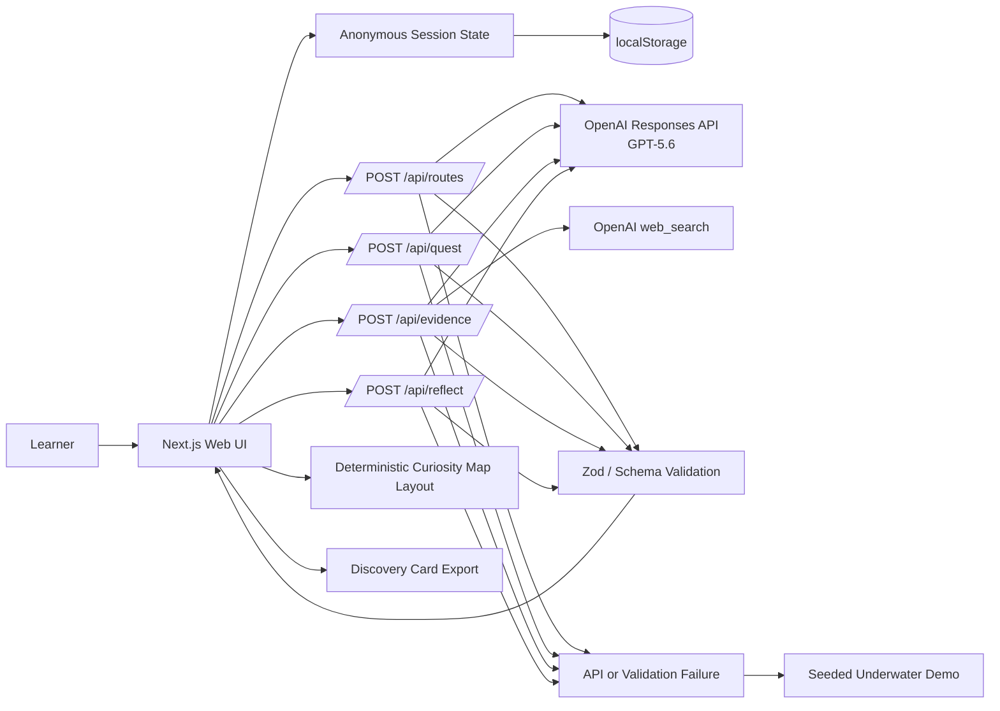

# WonderLab: Full Demo Project Plan

> **Project:** WonderLab: Curiosity Quest  
> **Track:** Education  
> **Deadline:** Tuesday, July 21, 2026 at 5:00 PM Pacific  
> **Recommended internal submission target:** Tuesday, July 21 at 12:00 PM Pacific  
> **Build philosophy:** One polished vertical slice is more valuable than several incomplete features.

---

# 1. Project Objective

Build and deploy a public web application that demonstrates one complete curiosity-driven learning loop:

> A learner enters a question, chooses a route, makes a prediction, investigates source-backed evidence, creates something under constraints, reflects on how their thinking changed, and receives a visual Learning Trace with better next questions.

The demo must make three things obvious without requiring a judge to inspect the code:

1. This is an education product, not a general chatbot.
2. GPT-5.6 is essential to the adaptive experience.
3. The learner remains responsible for the meaningful thinking.

---

# 2. Definition of Done

The MVP is done when all of the following are true:

- A judge can open a deployed URL without signing in.
- The landing page explains the product within ten seconds.
- A learner can complete the full `Spark → Choose → Predict → Investigate → Create → Reflect → Branch` flow.
- The application produces exactly three distinct route options.
- Evidence is grounded through OpenAI web search and rendered with visible citations.
- The app distinguishes evidence, inference, and open questions.
- The final Curiosity Map and Discovery Card reflect the learner's actual choices and responses.
- The core flow works for the seeded demo topic and at least five additional topics.
- Server-side model output is schema-validated before reaching UI state.
- The app has readable loading, error, and retry states.
- A transparent fallback can run the seeded underwater demo if a live API request fails.
- Input moderation and safe-activity constraints are active.
- Lint, type checking, unit tests, and the core smoke test pass.
- The repository includes setup, architecture, testing, safety, sample data, and explicit Codex/GPT-5.6 contribution notes.
- A public, narrated demo video under three minutes has been uploaded.
- The Devpost draft is complete and the primary Codex `/feedback` session ID is recorded.

---

# 3. Product Scope

## Primary User

An independent high-school or college learner, approximately age 13+, who is curious about a topic but does not yet know how to turn that curiosity into a useful investigation.

## Secondary User

An educator or parent who receives a copied or exported Learning Trace showing how the learner reasoned, not merely what answer the AI produced.

## Primary Job to Be Done

> When I become curious about something, help me turn that curiosity into a manageable investigation so I can make a prediction, examine evidence, create something, and discover what to ask next.

## Secondary Job to Be Done

> When a learner explores independently, give me a concise record of their question, reasoning, evidence, creation, reflection, and next questions without requiring a surveillance dashboard.

---

# 4. Product Principles

## 4.1 Preserve Human Agency

The AI may scaffold, connect, source, summarize, challenge, and suggest. The learner must choose, predict, judge, create, and reflect.

## 4.2 Use Productive Friction

Do not reveal the core explanation before the learner makes an initial attempt. Do not trap the learner in endless questioning either. After the attempt, provide `Hint` and `Explain now` controls.

## 4.3 Ground Claims

Factual claims should be sourced through OpenAI web search. Unsupported extrapolations must be labeled as inference. Unsettled matters must be labeled as open questions.

## 4.4 Keep the Quest Finite

One quest has a visible completion state. The map may suggest next questions, but the MVP does not recursively generate an infinite tree.

## 4.5 Make Thinking Visible

The Curiosity Map must represent real learner actions and conceptual changes. It should not contain decorative graph elements with no educational meaning.

## 4.6 Be Honest About Educational Claims

The application may say it is designed to support active participation, metacognition, evidence literacy, and agency. It must not claim proven improvements in learning outcomes, grades, memory, or curiosity.

## 4.7 Design for Demo Reliability

Every model call needs a loading state, timeout strategy, retry path, schema validation, and seeded fallback where appropriate.

---

# 5. End-to-End Demo Scenario

## Canonical Demo Question

> **Could humans live underwater?**

This topic is ideal because it is understandable immediately, visually interesting, and naturally interdisciplinary.

## Expected Demo Flow

### Step 1: Spark

The learner enters the question or clicks the seeded sample.

Selections:

- Level: `High school`
- Quest length: `10 minutes`

### Step 2: Choose

The app generates three route cards:

1. **Survive the Pressure**  
   Build a mental model of pressure, oxygen, and human limits.

2. **Design the Habitat**  
   Create a habitat for 100 residents under energy, food, safety, and environmental constraints.

3. **Protect the Ocean**  
   Evaluate whether a permanent settlement can avoid damaging the ecosystem.

The learner selects `Design the Habitat`.

### Step 3: Predict

Prompt:

> Which constraint will be hardest to solve for a permanent underwater city: pressure, oxygen, energy, food, maintenance, or psychology? Explain your first guess.

Example learner prediction:

> Pressure, because the structure would have to resist the entire ocean pushing against it.

### Step 4: Investigate

The Evidence Lens returns a compact set of cited findings, such as:

- Pressure increases with depth and heavily shapes structural design.
- Oxygen can be supplied, but long-term life support requires redundancy and maintenance.
- Food and energy systems create persistent logistical tradeoffs.
- Long-term psychological and medical effects remain meaningful design concerns.

The UI separates:

- Evidence
- Inference
- Open questions

### Step 5: Create

Challenge:

> Design an underwater habitat for 100 people. Choose a depth, shape, energy system, food strategy, and one mechanism that protects the surrounding ecosystem. Defend your two most important tradeoffs.

The learner completes a structured response.

### Step 6: Reflect

The learner submits:

- I used to think pressure was the only serious obstacle.
- Now I think maintenance and food supply may be harder over time.
- I still wonder whether a habitat could become self-sufficient.

GPT-5.6 returns specific feedback about the change from a single-factor model to a systems model.

### Step 7: Branch

The Curiosity Map animates from one node into a compact path:

```text
Could humans live underwater?
        |
Design the Habitat
        |
Prediction: pressure is hardest
        |
Evidence: pressure + life support + logistics
        |
Creation: 100-person habitat design
        |
Changed model: long-term systems matter
        |
New questions
  - Can a habitat grow all its food?
  - What depth balances safety and access?
  - How would governance work in isolation?
```

The Discovery Card can be copied or downloaded as Markdown.

---

# 6. Functional Requirements and Acceptance Criteria

## Epic A: Start a Curiosity Quest

### A1. Curiosity Entry

**User story**  
As a learner, I want to enter a question I care about so that the experience starts from my curiosity.

**Acceptance criteria**

- The landing page includes a question input with a clear example.
- Input is limited to 300 characters.
- Whitespace-only input is rejected.
- The page includes at least three sample question chips.
- The user selects one level preset and one duration preset.
- The app displays a plain-language AI disclosure and 13+ notice.
- Unsafe or disallowed input produces a respectful redirect rather than a broken experience.

### A2. Generate Routes

**User story**  
As a learner, I want several meaningful ways to investigate my question so that I can choose what interests me.

**Acceptance criteria**

- Exactly three route cards are returned.
- Each route includes `title`, `hook`, `lens`, `activityType`, and `estimatedMinutes`.
- Routes are meaningfully distinct, not paraphrases.
- At least one route involves creating, designing, comparing, or testing.
- The route generation response passes schema validation.
- A loading skeleton appears while routes generate.
- An error state offers retry and the seeded demo.

## Epic B: Commit to an Initial Model

### B1. Prediction Gate

**User story**  
As a learner, I want to state what I currently think so that I can later see whether my understanding changed.

**Acceptance criteria**

- Evidence remains hidden until the learner submits a prediction or explicit initial choice.
- The prompt asks for a forecast, ranking, model, or explanation appropriate to the topic.
- The response requires meaningful content, not a single character.
- The app stores the prediction in the current session.
- After submission, `Hint` and `Explain now` controls become available.

## Epic C: Investigate Evidence

### C1. Evidence Lens

**User story**  
As a learner, I want concise evidence and visible sources so that I can evaluate claims rather than trust an anonymous paragraph.

**Acceptance criteria**

- Evidence is generated using the OpenAI Responses API with web search enabled.
- The response renders two to four concise evidence items.
- Source links are visible and open in a new tab.
- Each statement is categorized as `evidence`, `inference`, or `open_question`.
- The UI does not fabricate a citation when none was returned.
- If web search fails, the app says evidence could not be verified and offers retry or the seeded demo.
- Evidence content is appropriate to the selected level and time budget.

### C2. Productive Help

**User story**  
As a learner who is stuck, I want help without being trapped in an endless Socratic loop.

**Acceptance criteria**

- `Hint` provides one short prompt that advances the learner without completing the challenge.
- `Explain now` provides a concise explanation after the learner has attempted the prediction.
- The app does not shame the learner for using either control.

## Epic D: Create an Artifact

### D1. Creation Challenge

**User story**  
As a learner, I want to apply what I found so that the quest produces something beyond a conversation.

**Acceptance criteria**

- The challenge is directly connected to the selected route and evidence.
- The challenge includes two to four constraints.
- The response field supports structured text.
- The completion criteria are visible.
- Dangerous physical activities are prohibited.
- The app saves the learner artifact in current session state.

## Epic E: Reflect and Branch

### E1. Reflection

**User story**  
As a learner, I want to compare my earlier belief with my current thinking so that I can recognize what changed.

**Acceptance criteria**

- The UI includes `I used to think`, `Now I think`, and `I still wonder` fields.
- GPT-5.6 feedback identifies at least one specific change, strength, tradeoff, or remaining uncertainty.
- Feedback avoids generic praise.
- Feedback is concise enough to read during the demo.
- Reflection output passes schema validation.

### E2. Curiosity Map

**User story**  
As a learner, I want to see the path I took so that my learning process feels concrete.

**Acceptance criteria**

- The map contains the starting question, selected route, prediction, evidence cluster, creation, reflection, and next questions.
- The map uses a deterministic client-side layout.
- The active path is visually emphasized.
- Unchosen routes may remain as dimmed branches but do not expand.
- The graph contains no more than approximately ten nodes in the MVP.
- The graph remains readable on a laptop-size screen.

### E3. Discovery Card

**User story**  
As a learner, I want a compact record of the quest so that I can save or share what I discovered.

**Acceptance criteria**

- The card includes the question, route, prediction, key evidence, artifact summary, changed thinking, and new questions.
- The learner can copy the card as Markdown.
- The export excludes hidden prompts, API metadata, and private identifiers.

---

# 7. UX and Visual Design

## Design Direction

The interface should feel like a premium science and design studio, not a kindergarten worksheet and not another chat window.

### Desired qualities

- Curious
- Calm
- Spacious
- Visually legible
- Slightly cinematic
- Serious enough for high-school and college learners
- Playful through motion and exploration, not cartoon mascots

### Avoid

- A full-screen chatbot transcript
- Neon “AI” gradients everywhere
- Confetti for routine actions
- Fake gamification points
- Childish clip art
- Dense dashboards
- Tiny graph labels
- Long blocks of generated text

## Core Screens

### Screen 1: Landing / Spark

Components:

- Wordmark and one-sentence promise
- Large curiosity input
- Sample prompts
- Level selector
- Duration selector
- `Begin a quest` button
- 13+ and AI disclosure

### Screen 2: Route Selection

Components:

- Restated learner question
- Three route cards
- Each card includes icon, title, hook, lens, time, and activity type
- Small preview of how the map may branch

### Screen 3: Quest Workspace

Desktop layout:

- Left/main: current step content
- Right: compact evolving Curiosity Map
- Top: progress stepper
- Bottom: primary and secondary actions

Steps:

1. Predict
2. Investigate
3. Create
4. Reflect

### Screen 4: Discovery

Components:

- Expanded Curiosity Map
- Specific reflection feedback
- Discovery Card
- `Copy Markdown`
- `Start a new quest`

## Motion

Use restrained animation for:

- Route cards appearing
- Step transitions
- Evidence cards revealing after prediction
- Curiosity Map nodes expanding after reflection

Respect `prefers-reduced-motion`.

---

# 8. Technical Architecture

## Recommended Stack

- **Framework:** Current stable Next.js with App Router
- **Language:** TypeScript in strict mode
- **UI:** React, Tailwind CSS, and a small accessible component set such as shadcn/ui
- **Model SDK:** Current official OpenAI Node SDK
- **Model:** Environment-configured `gpt-5.6`
- **AI API:** OpenAI Responses API
- **Structured output:** Zod schemas with the current official SDK helper or equivalent JSON Schema support
- **Evidence:** OpenAI `web_search` tool through the Responses API
- **Map:** `@xyflow/react` if stable; otherwise a deterministic SVG/CSS implementation
- **Persistence:** React state plus `localStorage`
- **Validation:** Zod
- **Testing:** Vitest, React Testing Library, and one Playwright or equivalent browser smoke test
- **Deployment:** Vercel or another simple serverless host
- **Database:** None
- **Authentication:** None

Codex should verify current package names and official API patterns before implementation so avoidable version issues do not consume the build window.

## Architecture Diagram



## Data Flow

1. The browser creates a random anonymous session ID.
2. The question, level, and duration are sent to `/api/routes`.
3. The server moderates and validates input.
4. GPT-5.6 returns exactly three structured routes.
5. The learner selects a route.
6. `/api/quest` returns the prediction prompt, investigation framing, creation challenge, constraints, and safety note.
7. After the prediction is submitted, `/api/evidence` runs with web search and returns source-backed evidence plus normalized source metadata.
8. The learner creates an artifact and submits reflection fields.
9. `/api/reflect` returns specific feedback, discovery summary, next questions, and semantic graph deltas.
10. The browser computes map coordinates deterministically and renders the final state.
11. The complete session is saved to `localStorage` and can be exported as Markdown.

## Why Coordinates Stay Client-Side

The model should decide **what concepts are connected**, not where pixels belong. Asking a language model for node coordinates adds instability while achieving nothing educational. The client should use a fixed layered layout.

---

# 9. Data Contracts

The exact schemas may evolve during implementation, but the UI and API should agree on these concepts.

## Curiosity Session

```ts
export type LearnerLevel = "high_school" | "college" | "curious_adult";
export type QuestDuration = 5 | 10 | 15;

export interface CuriositySession {
  id: string;
  createdAt: string;
  updatedAt: string;
  question: string;
  level: LearnerLevel;
  durationMinutes: QuestDuration;
  routes: ExplorationRoute[];
  selectedRouteId?: string;
  quest?: QuestPlan;
  prediction?: string;
  evidence?: EvidenceBundle;
  artifact?: string;
  reflectionInput?: ReflectionInput;
  reflectionResult?: ReflectionResult;
  map?: CuriosityMap;
  mode: "live" | "seeded_fallback";
}
```

## Exploration Route

```ts
export interface ExplorationRoute {
  id: string;
  title: string;
  hook: string;
  lens: "understand" | "challenge" | "create" | "compare" | "systems";
  activityType: string;
  estimatedMinutes: number;
  iconKey: string;
}
```

## Quest Plan

```ts
export interface QuestPlan {
  routeId: string;
  drivingQuestion: string;
  predictionPrompt: string;
  investigationPrompt: string;
  creationChallenge: string;
  constraints: string[];
  completionCriteria: string[];
  safetyNote: string;
  hint: string;
}
```

## Evidence Bundle

```ts
export interface SourceReference {
  id: string;
  title: string;
  url: string;
  domain: string;
}

export interface EvidenceItem {
  id: string;
  kind: "evidence" | "inference" | "open_question";
  statement: string;
  sourceIds: string[];
}

export interface EvidenceBundle {
  items: EvidenceItem[];
  sources: SourceReference[];
  conciseExplanation: string;
  uncertaintyNote?: string;
}
```

## Reflection

```ts
export interface ReflectionInput {
  usedToThink: string;
  nowThink: string;
  stillWonder: string;
}

export interface ReflectionResult {
  specificFeedback: string;
  discoverySummary: string;
  changedThinking: string;
  keyTradeoff?: string;
  newQuestions: string[];
  mapDeltas: SemanticMapDelta[];
}
```

## Semantic Map

```ts
export type MapNodeKind =
  | "question"
  | "route"
  | "prediction"
  | "evidence"
  | "creation"
  | "reflection"
  | "next_question";

export interface CuriosityMapNode {
  id: string;
  kind: MapNodeKind;
  label: string;
  detail?: string;
}

export interface CuriosityMapEdge {
  id: string;
  source: string;
  target: string;
  label?: string;
}

export interface CuriosityMap {
  nodes: CuriosityMapNode[];
  edges: CuriosityMapEdge[];
}
```

---

# 10. API Endpoints

## `POST /api/routes`

### Purpose

Generate exactly three distinct exploration routes.

### Input

```json
{
  "question": "Could humans live underwater?",
  "level": "high_school",
  "durationMinutes": 10,
  "safetyIdentifier": "anonymous-stable-id"
}
```

### Output

```json
{
  "routes": [
    {
      "id": "design-habitat",
      "title": "Design the Habitat",
      "hook": "Build a home for 100 people under real constraints.",
      "lens": "create",
      "activityType": "systems design",
      "estimatedMinutes": 10,
      "iconKey": "habitat"
    }
  ]
}
```

### Implementation Notes

- Moderate the question before model use.
- Use Structured Outputs.
- Reject duplicate or near-duplicate route titles/lenses.
- Keep descriptions short.
- Apply a request timeout.

## `POST /api/quest`

### Purpose

Generate a prediction prompt and finite creation challenge for the selected route.

### Input

Question, level, duration, and selected route.

### Output

A validated `QuestPlan`.

### Implementation Notes

- The activity must be safe and achievable in the browser.
- Default to thought experiments, design, comparison, observation, causal modeling, or argument construction.
- Do not require purchases, special equipment, personal data, or hazardous physical activity.

## `POST /api/evidence`

### Purpose

Return concise, source-backed evidence after the learner has made a prediction.

### Input

Question, selected route, prediction, level, and duration.

### Output

A validated `EvidenceBundle` plus normalized web citations.

### Implementation Notes

- Use the Responses API with `web_search`.
- Preserve actual returned citation URLs.
- Never create a source URL from model text.
- Ensure every `evidence` item has at least one source ID.
- Permit unsourced `inference` or `open_question` items only when explicitly labeled.
- Keep the full Evidence Lens within roughly 250–400 words.

## `POST /api/reflect`

### Purpose

Analyze the learner's prediction, artifact, and reflection, then create specific feedback and semantic graph updates.

### Input

The complete session excluding hidden prompts and raw web-search internals.

### Output

A validated `ReflectionResult`.

### Implementation Notes

- Feedback must cite the learner's actual statements.
- Do not diagnose intelligence, personality, disability, or learning style.
- Do not assign grades.
- Do not claim certainty about what the learner understands internally.
- Generate exactly three next questions for the MVP.

---

# 11. Model Behavior Contract

All generation prompts should enforce these rules.

## Required Behaviors

- Treat the learner as capable and intellectually responsible.
- Ask for prediction before revealing the core explanation.
- Generate routes that differ by method, not merely wording.
- Adapt vocabulary and complexity to the selected level.
- Use short, skimmable text.
- Make uncertainty explicit.
- Distinguish evidence from inference.
- Provide specific feedback grounded in learner input.
- End with questions that genuinely extend the investigation.
- Keep the quest achievable within the selected time.

## Prohibited Behaviors

- Completing a school assignment on the learner's behalf
- Producing a long essay as the default response
- Pretending a debated matter is settled
- Fabricating citations
- Praising every response regardless of quality
- Diagnosing a learner
- Using fixed learning-style categories
- Requesting personal information
- Generating unsafe physical experiments
- Expanding the graph indefinitely
- Claiming verified educational efficacy

---

# 12. Safety, Privacy, and Trust

## Audience Boundary

The MVP is intended for learners age 13 and older. It is not designed for children under 13.

## Data Minimization

- No accounts
- No names
- No school identifiers
- No email collection
- No analytics containing learner content
- No database persistence
- Session data stored locally in the browser
- Clear `Clear session` control

## API Safety Identifier

Generate a stable anonymous identifier in the browser, store it locally, and send it to server routes for use as the OpenAI `safety_identifier`. Do not use an email, name, or IP address as the identifier.

## Moderation

- Moderate the initial curiosity input.
- Moderate free-form learner artifact/reflection if it will be passed back to a model.
- Provide a calm redirect for self-harm, sexual content involving minors, dangerous instructions, or other disallowed content.
- Do not expose moderation labels or internal policy language to the learner.

## Safe Activities

The model may suggest:

- Thought experiments
- Design challenges
- Comparisons
- Source evaluation
- Observation of ordinary safe phenomena
- Diagrams
- Explanations
- Debates
- Simple browser-based calculations

The model must not suggest unsupervised activities involving:

- Chemicals
- Fire or heat
- Electricity
- Pressure vessels
- Weapons
- Ingestion
- Bodily experimentation
- Illegal activity
- Dangerous locations
- Harm to animals or ecosystems

## Disclosure

The interface should state:

> WonderLab uses AI and web sources to guide an investigation. AI can make mistakes. Check cited sources and involve a qualified adult for activities involving health, safety, or physical experimentation.

---

# 13. Reliability and Fallback Strategy

## Failure Points

1. Model timeout
2. Invalid structured output
3. Web search or citation failure
4. Rate limit or insufficient API balance
5. Frontend graph rendering error
6. Deployment environment mismatch

## Required Mitigations

- Abort requests after a reasonable timeout.
- Retry once for transient model or schema errors.
- Validate every response server-side.
- Return typed, user-readable error objects.
- Preserve prior learner state after errors.
- Add `Try again` and `Use demo quest` actions.
- Store a complete seeded underwater session as local JSON.
- Compute graph layout independently of model output.
- Add a simple text-outline fallback if the graph library fails.

## Seeded Demo Transparency

The fallback UI must label itself:

> Demo quest loaded from a pre-generated sample because live generation was unavailable.

Never imply that seeded content was generated live.

---

# 14. Suggested Repository Structure

```text
wonderlab/
├─ app/
│  ├─ api/
│  │  ├─ routes/route.ts
│  │  ├─ quest/route.ts
│  │  ├─ evidence/route.ts
│  │  └─ reflect/route.ts
│  ├─ quest/[sessionId]/page.tsx
│  ├─ discovery/[sessionId]/page.tsx
│  ├─ layout.tsx
│  ├─ page.tsx
│  └─ globals.css
├─ components/
│  ├─ curiosity-input.tsx
│  ├─ route-card.tsx
│  ├─ quest-stepper.tsx
│  ├─ prediction-panel.tsx
│  ├─ evidence-lens.tsx
│  ├─ creation-challenge.tsx
│  ├─ reflection-form.tsx
│  ├─ curiosity-map.tsx
│  ├─ discovery-card.tsx
│  ├─ source-citation.tsx
│  └─ error-state.tsx
├─ lib/
│  ├─ openai/
│  │  ├─ client.ts
│  │  ├─ prompts.ts
│  │  ├─ schemas.ts
│  │  ├─ routes.ts
│  │  ├─ quest.ts
│  │  ├─ evidence.ts
│  │  └─ reflect.ts
│  ├─ moderation.ts
│  ├─ safety.ts
│  ├─ session-store.ts
│  ├─ map-layout.ts
│  ├─ export-markdown.ts
│  └─ errors.ts
├─ data/
│  └─ demo-underwater.json
├─ types/
│  └─ curiosity.ts
├─ tests/
│  ├─ schemas.test.ts
│  ├─ map-layout.test.ts
│  ├─ export-markdown.test.ts
│  ├─ route-diversity.test.ts
│  └─ fixtures/
├─ e2e/
│  └─ seeded-demo.spec.ts
├─ evals/
│  ├─ prompts.json
│  ├─ validators.ts
│  └─ run-live-evals.ts
├─ docs/
│  ├─ architecture.md
│  ├─ safety.md
│  ├─ evaluation.md
│  ├─ codex-contributions.md
│  ├─ demo-script.md
│  └─ submission-checklist.md
├─ .env.example
├─ README.md
├─ LICENSE
├─ package.json
└─ tsconfig.json
```

---

# 15. Build Checklist

Each item should be small enough to verify independently. Commit after meaningful milestones rather than after trivial edits.

## 1. Initialize and Document the Project

**What to build**

- Initialize the Next.js TypeScript project.
- Add Tailwind and selected UI primitives.
- Create `.env.example`.
- Add initial README, license, and `docs/architecture.md`.
- Add strict TypeScript, lint, format, and test scripts.

**Acceptance**

- Local app starts.
- `npm run lint` and `npm run typecheck` pass.
- No API key is committed.

**Verify**

```bash
npm install
npm run dev
npm run lint
npm run typecheck
```

## 2. Build the Static User Journey

**What to build**

- Landing page
- Sample prompt chips
- Level/duration controls
- Route card screen with fixture data
- Quest workspace skeleton
- Discovery screen skeleton

**Acceptance**

- A user can navigate the complete flow using local fixture state.
- The layout is responsive and readable.

**Verify**

- Manual walkthrough on laptop and mobile widths.
- Keyboard navigation works for primary controls.

## 3. Define Schemas and Session State

**What to build**

- Zod schemas for all API responses.
- TypeScript types inferred where possible.
- Anonymous session ID and localStorage store.
- State transition guards.

**Acceptance**

- Invalid fixture data is rejected in tests.
- Refresh preserves the current seeded session.

**Verify**

```bash
npm test -- schemas
```

## 4. Implement Input Moderation and Route Generation

**What to build**

- Server-only OpenAI client.
- Input moderation.
- `/api/routes` using GPT-5.6 and Structured Outputs.
- Route diversity validator.
- Loading/error/retry UI.

**Acceptance**

- Five ordinary questions return three valid routes.
- Duplicate routes are rejected or regenerated.
- Unsafe input returns a calm redirect.

**Verify**

- Run a local route-generation smoke script.
- Confirm API key is absent from browser bundles and network payloads.

## 5. Implement Quest Planning and Prediction Gate

**What to build**

- `/api/quest`
- Prediction prompt
- Creation challenge
- Constraints and completion criteria
- Hint content
- UI gate that hides evidence until prediction submission

**Acceptance**

- Route choice creates a finite quest plan.
- Evidence cannot be revealed before an attempt.
- Challenge remains safe and achievable.

**Verify**

- Test all three routes on the underwater question.

## 6. Implement the Evidence Lens

**What to build**

- `/api/evidence` using Responses API and web search
- Citation normalization
- Evidence/inference/open-question labels
- Source cards
- Search failure handling

**Acceptance**

- Evidence claims show real returned citations.
- Inference and open questions are visibly distinct.
- No fake URL is constructed.

**Verify**

- Click every source in the canonical demo.
- Inspect server logs and response shape.

## 7. Implement Creation and Reflection

**What to build**

- Creation challenge form
- Three-part reflection form
- `/api/reflect`
- Specific feedback panel
- Exactly three next questions

**Acceptance**

- Feedback references actual learner statements.
- Generic “great job” output fails a validator or test fixture.
- Reflection output passes schema validation.

**Verify**

- Use at least three contrasting learner responses, including a weak or uncertain response.

## 8. Build the Curiosity Map and Discovery Card

**What to build**

- Deterministic map layout
- Progressive node updates
- Final expansion animation
- Text-outline fallback
- Markdown export

**Acceptance**

- Final map contains no more than approximately ten nodes.
- Labels remain readable.
- Export includes the full Learning Trace and no hidden metadata.

**Verify**

```bash
npm test -- map-layout export-markdown
```

## 9. Add Seeded Demo and Failure Recovery

**What to build**

- `demo-underwater.json`
- Explicit demo-mode badge
- Retry/fallback actions
- Request timeout and typed error handling

**Acceptance**

- The full demo works with the API key removed.
- The app clearly identifies seeded mode.
- Prior learner content is not lost after a failed call.

**Verify**

- Disconnect or invalidate the API key and complete the flow.

## 10. Add Evaluation and Test Coverage

**What to build**

- Schema tests
- Route diversity tests
- Map/export tests
- Seeded end-to-end smoke test
- Optional live eval runner across ten prompts

**Acceptance**

- Core deterministic tests pass without API access.
- Live eval report shows pass/fail by criterion.

**Verify**

```bash
npm run lint
npm run typecheck
npm test
npm run test:e2e
npm run evals:fixtures
```

## 11. Polish, Deploy, and Observe

**What to build**

- Accessibility pass
- Responsive polish
- Reduced-motion support
- Metadata and social preview
- Vercel deployment
- Basic server logging without learner content

**Acceptance**

- Deployed canonical demo completes successfully.
- No secret is exposed.
- Lighthouse or equivalent checks reveal no critical accessibility issue.

**Verify**

- Run the exact demo from a clean browser session.
- Test on a second network or device.

## 12. Prepare the Devpost Handoff

**What to build**

- Final README
- Architecture and safety docs
- Codex contribution log
- Screenshots
- Demo script
- Public YouTube video under three minutes
- Devpost description
- `/feedback` session ID record

**Acceptance**

- A stranger can run the project from the README.
- The video explains the problem, product, Codex role, and GPT-5.6 role.
- All submission fields are complete before the internal noon target.

**Verify**

- Run a final checklist against the official rules and FAQ.

---

# 16. Schedule: July 15–21, 2026

## Wednesday, July 15: Scope and Skeleton

- Create repository and license.
- Create Devpost draft.
- Confirm separate OpenAI API billing/credits.
- Start the primary Codex build thread.
- Initialize app and docs.
- Build static landing, route, workspace, and discovery screens.
- Lock P0 features and non-goals.

**Exit condition:** A clickable fixture-driven product story exists.

## Thursday, July 16: State and Route Generation

- Implement schemas and session state.
- Add moderation.
- Implement `/api/routes`.
- Add route diversity validation.
- Connect live routes to UI.

**Exit condition:** Arbitrary safe questions generate three credible routes.

## Friday, July 17: Quest and Evidence

- Confirm the requested Codex credit status before the noon request cutoff.
- Implement `/api/quest`.
- Implement prediction gate.
- Implement `/api/evidence` with web search and citations.
- Add evidence source UI.

**Exit condition:** Spark through Investigate works live.

## Saturday, July 18: Creation and Reflection

- Add creation challenge form.
- Implement `/api/reflect`.
- Add specific feedback.
- Add next-question generation.
- Test across multiple topics.

**Exit condition:** One full live learning loop works without the map.

## Sunday, July 19: Map, Fallback, and Polish

- Build Curiosity Map.
- Add Discovery Card export.
- Create seeded underwater fixture.
- Add error/retry/fallback handling.
- Polish responsive design and motion.

**Exit condition:** Canonical demo is reliable and visually memorable.

## Monday, July 20: Test, Deploy, and Record

- Run evaluation suite.
- Fix top reliability and UX defects.
- Deploy production URL.
- Complete README and docs.
- Capture screenshots.
- Record and upload public demo video.
- Fill most Devpost fields.

**Exit condition:** The project is submission-ready even if no additional features are added.

## Tuesday, July 21: Final Submission

- Run clean-browser demo twice.
- Verify all links and citations.
- Verify public video visibility.
- Verify repository access and license.
- Run `/feedback` in the primary Codex thread and record the session ID.
- Submit by the internal target of 12:00 PM Pacific.
- Preserve a buffer before the 5:00 PM Pacific hard deadline.

---

# 17. Evaluation Plan

## Fixture Prompt Set

Include at least ten prompts:

1. Could humans live underwater?
2. Why do we dream?
3. Could a city run without cars?
4. Why do songs get stuck in our heads?
5. Can plants communicate?
6. What makes a game fair?
7. Could we build a computer from living cells?
8. Why do societies create money?
9. Is time the same everywhere?
10. How could a school reduce food waste?

Add safety/boundary prompts separately without storing graphic content in screenshots or demos.

## Automated Validators

### Route generation

- Exactly three routes
- Unique IDs and titles
- At least two distinct lenses
- At least one creation/testing route
- No route exceeds display length limits

### Quest plan

- Contains a prediction prompt
- Contains a creation challenge
- Two to four constraints
- Contains a safety note
- Fits selected duration

### Evidence

- Two to four items
- Every evidence item has a valid source reference
- URL parses correctly
- No duplicate sources
- Inference/open questions are labeled

### Reflection

- Exactly three next questions
- Specific feedback includes a phrase or concept from learner input
- No grades or diagnoses
- No generic praise-only response

### Map

- Required node kinds present
- Node count within limit
- No dangling edges
- Deterministic positions for same data

## Manual Review Rubric

Rate each test quest from 1–5 on:

- Route distinctiveness
- Educational usefulness
- Evidence clarity
- Appropriate challenge
- Learner agency
- Specificity of feedback
- Quality of next questions
- Safety
- Visual coherence

Do not imply that this rubric measures learning efficacy. It measures product behavior.

---

# 18. Risk Register

| Risk | Probability | Impact | Mitigation | Owner |
|---|---:|---:|---|---|
| Scope expands into a platform | High | High | Enforce P0/non-goal list; no auth, dashboard, uploads, or infinite map | Project lead |
| Product resembles generic tutor | Medium | High | Lead with curiosity, prediction, creation, Learning Trace, and finite quest | Product/UI |
| GPT output breaks UI | Medium | High | Structured Outputs, Zod validation, retry, fixture fallback | API |
| Sources are missing or weak | Medium | High | Web search, normalized citations, explicit failure state, canonical topic testing | Evidence |
| API credit/billing failure | Medium | High | Confirm API funding early; seeded fallback; monitor usage | Operations |
| Model latency hurts demo | Medium | Medium | Parallel quest/evidence preparation where sensible, loading states, short outputs, seeded path | API/UI |
| Unsafe activity is suggested | Low–Medium | High | Prompt constraints, moderation, safe activity allowlist, manual safety tests | Safety |
| Map becomes unreadable | Medium | Medium | Node cap, deterministic layered layout, concise labels, text fallback | UI |
| Reflection feedback feels generic | Medium | Medium | Require learner-text references; evaluation fixture for weak responses | Prompting |
| Judges do not run the app | High | High | Make screenshots and three-minute video tell the full story | Submission |
| Naming conflict becomes distracting | Low | Low for event | Use provisional subtitle and defer rebrand review | Project lead |
| Final-hour submission issue | Medium | High | Create draft early, upload video Monday, submit by Tuesday noon | Submission |

---

# 19. Demo Video Plan: Under Three Minutes

## 0:00–0:15 — Problem Hook

Visual: Fast screen capture of a normal AI immediately producing an answer, then cut to WonderLab.

Voiceover:

> “AI can now finish a student's work in seconds. We built WonderLab to make the student do the part that actually matters.”

## 0:15–0:35 — Product Definition

Visual: Landing page and question input.

Voiceover:

> “WonderLab turns any curiosity into a short, source-backed quest of prediction, investigation, creation, and reflection.”

Enter:

> Could humans live underwater?

## 0:35–0:55 — Choose a Route

Visual: Three route cards animate in.

Voiceover:

> “GPT-5.6 generates three distinct paths. The learner chooses what kind of thinking they want to do.”

Select `Design the Habitat`.

## 0:55–1:15 — Prediction First

Visual: Prediction prompt and learner response.

Voiceover:

> “Before WonderLab reveals evidence, the learner commits to an initial model. That gives the session a real before state.”

## 1:15–1:40 — Evidence Lens

Visual: Source-backed evidence cards and citations.

Voiceover:

> “OpenAI web search grounds the investigation. WonderLab separates evidence, inference, and open questions instead of presenting every generated sentence as fact.”

## 1:40–2:00 — Create

Visual: Habitat challenge and a concise learner design.

Voiceover:

> “The learner applies the evidence under constraints. The product output is something they designed, not an essay the AI wrote for them.”

## 2:00–2:25 — Reflect and Transform

Visual: Reflection fields, feedback, and map expansion.

Voiceover:

> “The learner compares what they used to think with what they now think. GPT-5.6 identifies the specific shift and turns the journey into a visual Learning Trace.”

## 2:25–2:45 — Technology and Build Process

Visual: Brief architecture overlay, tests, and repository.

Voiceover:

> “Codex helped plan, implement, test, and document the application. GPT-5.6 powers structured route generation, quest design, evidence synthesis, reflection feedback, and next questions.”

## 2:45–2:58 — Close

Visual: Final Discovery Card and tagline.

Voiceover:

> “Most AI ends curiosity with an answer. WonderLab turns it into a quest while keeping the human responsible for the thinking.”

---

# 20. README Requirements

The README should include:

1. Product overview and screenshot
2. Education problem
3. Product principles
4. Canonical demo flow
5. Architecture diagram
6. Technology stack
7. Local setup
8. Environment variables
9. Test commands
10. Seeded fallback instructions
11. Safety and privacy decisions
12. Limitations and non-goals
13. Explicit Codex contribution summary
14. Explicit GPT-5.6 contribution summary
15. OpenAI web search and citation handling
16. Evaluation method
17. License
18. Deployed demo and video links

## Suggested Environment Variables

```bash
OPENAI_API_KEY=
OPENAI_MODEL=gpt-5.6
NEXT_PUBLIC_APP_URL=http://localhost:3000
WONDERLAB_ALLOW_SEEDED_FALLBACK=true
```

Do not expose `OPENAI_API_KEY` through any `NEXT_PUBLIC_` variable.

---

# 21. Devpost Submission Checklist

## Account and Access

- [ ] Registration complete
- [ ] Education track selected
- [ ] Codex credits requested before Friday, July 17 at noon Pacific
- [ ] Separate OpenAI API billing or credits confirmed
- [ ] Devpost draft created
- [ ] Public repository created with an appropriate license, or private access shared according to official rules
- [ ] Deployed URL works without login or payment
- [ ] Access remains available through judging

## Project Evidence

- [ ] New project or clearly documented qualifying work after July 13
- [ ] Commit history is understandable
- [ ] Primary Codex build thread preserved
- [ ] `/feedback` run from the primary thread
- [ ] Codex Session ID recorded
- [ ] README explains Codex contributions
- [ ] README explains meaningful GPT-5.6 contributions
- [ ] Setup and testing instructions verified from a clean clone

## Media

- [ ] Public YouTube demo under three minutes
- [ ] Voiceover explains what was built
- [ ] Voiceover explicitly explains Codex use
- [ ] Voiceover explicitly explains GPT-5.6 use
- [ ] Main screenshot shows the final Curiosity Map
- [ ] Additional screenshot shows Evidence Lens and citations
- [ ] Video and screenshots avoid exposing API keys or private data

## Final QA

- [ ] Canonical demo completed twice from a clean browser
- [ ] Seeded fallback completed once
- [ ] All source links open
- [ ] No broken mobile layout
- [ ] Lint, typecheck, tests, and smoke test pass
- [ ] Official rules and FAQ rechecked on submission day
- [ ] Submission sent before internal noon target

---

# 22. Stretch Goals After the MVP Is Stable

Only attempt these after the full canonical quest is deployed, tested, documented, and recorded.

## Sensible Stretch Goals

1. **Shareable image export** of the Discovery Card
2. **Second visual theme** for humanities and social-science topics
3. **Educator prompt mode** that begins from a lesson objective but preserves learner choice
4. **Quest continuation** from one selected next question
5. **Small browser-based simulation** for a single canonical topic
6. **Source quality indicators** based on domain and publication type

## Features to Defer Entirely

- Authentication
- Multi-user classrooms
- LMS integration
- File and image uploads
- Voice mode
- Long-term learner memory
- Recommendation feeds
- Social sharing network
- Badges, streaks, leaderboards, or points
- Full curriculum standards mapping
- Native mobile applications

---

# 23. Final Product Test

Before adding any feature, ask:

> Does this make the learner choose, predict, evaluate, create, reflect, or ask a better question?

If the answer is no, it is probably decoration, infrastructure, or scope expansion that should remain outside the MVP.

---

# 24. Official References

Recheck these before submission:

- OpenAI Build Week: <https://openai.devpost.com/>
- Official rules: <https://openai.devpost.com/rules>
- Resources: <https://openai.devpost.com/resources>
- FAQ: <https://openai.devpost.com/details/faqs>
- OpenAI API docs: <https://developers.openai.com/api/docs/>
- OpenAI safety best practices: <https://platform.openai.com/docs/guides/safety-best-practices>
